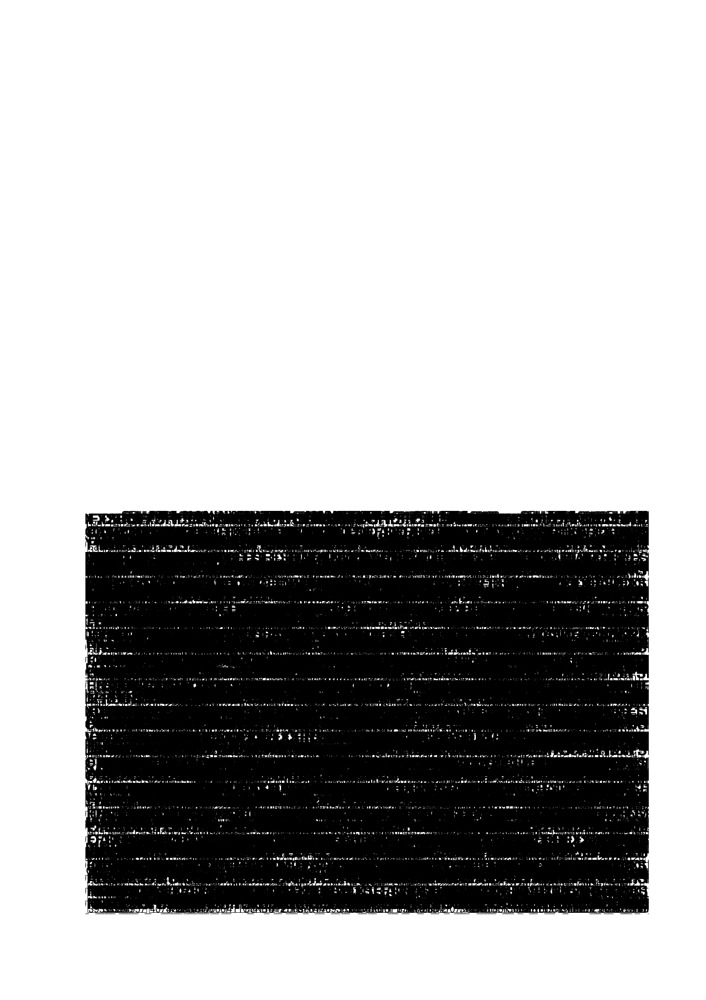

# APB AES Core — RTL-to-GDSII Physical Sign-Off
## What is This Project?

Modern embedded devices—from automotive controllers and smart cards to IoT sensors—need to encrypt sensitive data without choking the main CPU. Running cryptographic algorithms like AES (Advanced Encryption Standard) in software is slow and consumes significant power.

This project is an **on-chip hardware accelerator**:
* **The Brain (AES-128 Core):** A dedicated digital circuit that performs high-speed AES encryption and decryption entirely in silicon hardware.
* **The Bridge (APB Interface):** Uses the industry-standard AMBA APB (Advanced Peripheral Bus) protocol, allowing any microcontroller or SoC host (like an ARM Cortex or RISC-V processor) to configure keys, stream plaintext, and read back ciphertext using standard memory-mapped register reads and writes.
* **Silicon Implementation:** Fully converted from high-level Verilog code into physical silicon mask geometries (GDSII) using the open-source Qflow toolchain and the OSU 0.35µm (350nm) CMOS standard-cell library.

RTL-to-GDSII physical implementation of an APB AES core using Qflow on OSU 350nm CMOS (osu035).

## Sign-Off Highlights
- **DRC:** 0 Violations (Clean)
- **LVS:** Passed (Circuits match uniquely in Netgen)
- **Fmax:** 381.25 MHz (Tcrit = 2.623 ns)
- **Setup Slack:** Met (Tsetup = 0.199 ns)
- **Skew:** 0.049 ns

## Deliverables
- `backend_deliverables/apb_aes.gds`: Photomask GDSII stream database
- `backend_deliverables/apb_aes.def`: Placed and routed DEF layout
- `backend_deliverables/lvs_comp.out`: Netgen equivalence proof
- `backend_deliverables/timing_sta.log`: Post-route STA timing report
- `backend_deliverables/apb_aes_signoff_report.pdf`: 2-page physical sign-off report

## Silicon Layout

